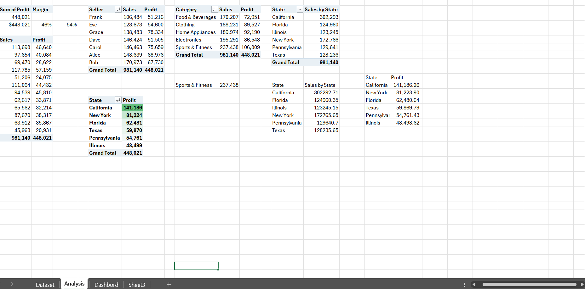
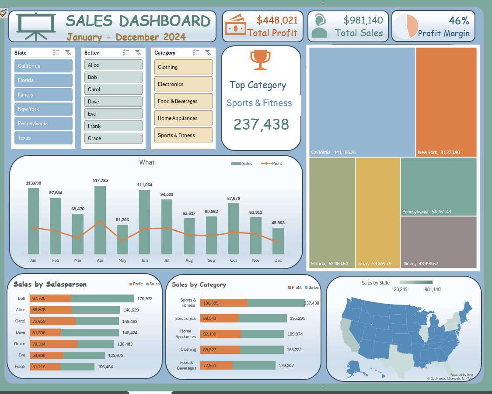

## Quinn Stores Sales Analysis

### 1. Introduction
This project comprehensively analyzes the sales and profit data for an imaginary store called **Quinn Stores**, across various categories, products, and regions. The goal is to identify key insights and provide actionable recommendations to maximize the company's profit margins and improve overall performance.
**_Disclaimer_**: The dataset used in this project is not affiliated with any company. The report aims solely to showcase @Raregideon’s skills as a Data Analyst. 

### 2. Problem Statement
The company aims to maximize its profit margins by understanding the performance of different products, categories, and regions. The analysis seeks to identify high-performing areas, underperforming segments, and potential growth opportunities. Specific objectives include:
- Analyzing total sales and profit by category and product.
- Understanding regional sales and profit distribution.
- Identifying monthly sales trends.
- Providing recommendations for optimizing profit margins.

### 3. Skills Demonstrated
The analysis showcases a variety of data analysis skills, including:
- Data cleaning and preprocessing.
- Descriptive statistics and aggregation.
- Data visualization for insightful representation.
- Analytical thinking and problem-solving.
- Business intelligence and strategic planning.

#### 4. Data Sourcing
The data for this analysis was sourced from MyOnlineTrainingHub on YouTube, an Excel file containing sales records. The dataset includes information on the month, seller, category, product, state, sales, and profit. This dataset serves as the foundation for all subsequent analysis.

#### 5. Data Transformation
The data transformation process involved:
- Loading the dataset from the Excel file.
- Checking for missing values and data inconsistencies.
- Aggregating sales and profit data by various dimensions such as category, product, and state.
- Calculating additional metrics such as profit margins.

#### 6. Data Modelling
Data modeling involved summarizing and structuring the data to answer key business questions. This included:
- Grouping data by category and product to identify high-performing segments.
- Aggregating data by state to understand regional performance.
- Analyzing monthly trends to identify seasonal patterns.

#### 7. Analytics and Visualization

The analytics process included:
- Calculating total sales and profit by category and product to identify top performers.
- Summarizing sales and profit by state to reveal regional insights.
- Examining monthly sales trends to identify peaks and troughs.
- Visualizing the data using charts and graphs for easy interpretation and presentation.

  
Key visualizations included:
- Bar charts for total sales and profit by category and product.
- Treemaps for regional sales and profit distribution.
- Line charts for monthly sales trends.

#### 8. Conclusion and Recommendations
The analysis revealed several key insights:
- **High-Performing Categories and Products:** Sports & Fitness and Home Appliances categories, along with products like Jeans and Microwave, are top performers in terms of profit.
- **Regional Performance:** Certain states contribute significantly to sales and profit, while others underperform.
- **Seasonal Trends:** Monthly sales trends indicate seasonal variations that can inform inventory and marketing strategies.

**Recommendations:**
- **Focus on High-Performing Categories:** Promote and expand the product range in high-performing categories like Sports & Fitness and Home Appliances.
- **Targeted Marketing:** Develop strategies tailored to underperforming regions to boost sales.
- **Optimize Inventory:** Align inventory management with seasonal demand patterns to reduce holding costs and prevent stockouts.
- **Review Pricing Strategies:** Analyze profit margins and adjust pricing strategies to ensure competitive yet profitable pricing.
By implementing these recommendations, the company can enhance its profitability and achieve sustainable growth.

